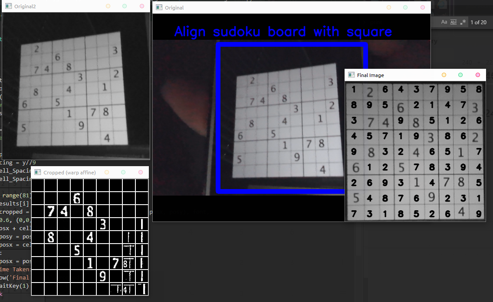

# Opencv2Sudoku

## This program uses a combination of tensorflow libraries, opencv2 and numpy matrix manipulation to solve sudoku puzzles real time from a video feed.

This project is one I have wanted to do for a while but I finally got around to doing it.
Here is an example screenshot

To run this you must have a webcam and the correct libraries installed.
