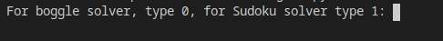

# Computer-Vision-Boggle&Sudoku-solver

## This program uses a combination of tensorflow libraries, opencv2,  and numpy matrix manipulation to solve sudoku puzzles and boggle boards real time from a video feed.

This project is one I have wanted to do for a while but I finally got around to doing it.
Here is an example screenshot

To run this you must have a webcam and the correct libraries installed, I recommend you use GPU to train the boggle solver.
Libraries include:
NumPy
dlxsudoku
OpenCV
Tensorflow 2.3 or higher
Tensorflow keras

This relies on multiprocessing features which exist in python version 3.7.5 and up.